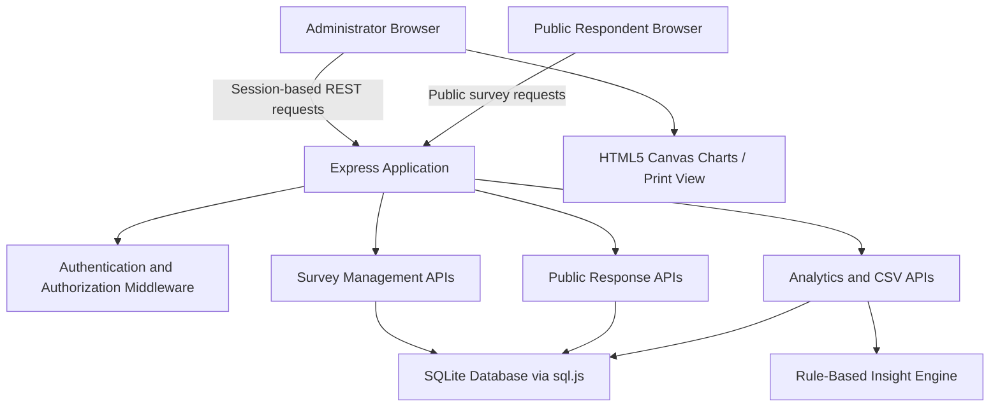
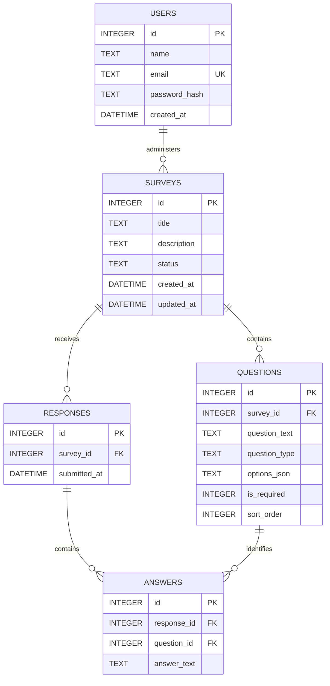
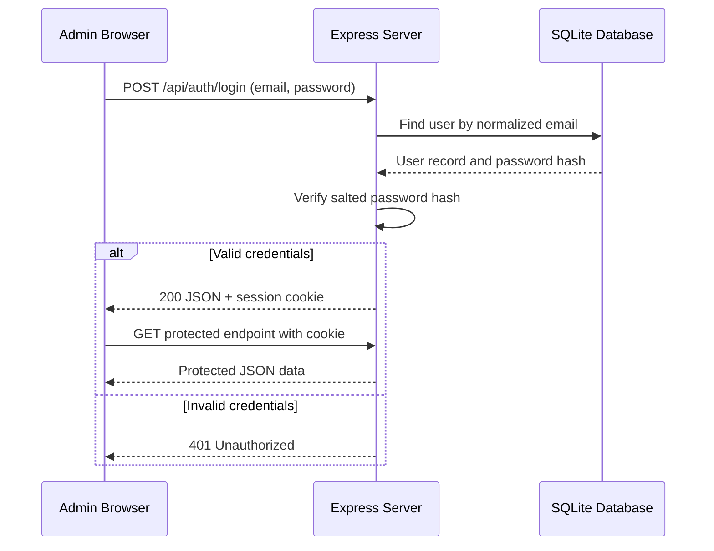

# Research Survey Analytics Dashboard

## Complete Project Report

**Project type:** CSE499 Final-Semester Internship Project  
**System name:** Research Survey Analytics Dashboard  
**Version:** 1.0.0  
**Report date:** September 9, 2026  
**Source repository:** [monourhosan/Research-Survey-Analytics-Dashboard](https://github.com/monourhosan/Research-Survey-Analytics-Dashboard)  
**Live deployment:** [research-survey-analytics-dashboard.vercel.app](https://research-survey-analytics-dashboard.vercel.app/login.html)

---

## Table of Contents

1. [Executive Summary](#1-executive-summary)
2. [Problem Statement](#2-problem-statement)
3. [Objectives and Scope](#3-objectives-and-scope)
4. [Users and Main Use Cases](#4-users-and-main-use-cases)
5. [Feature Summary](#5-feature-summary)
6. [Technology Stack](#6-technology-stack)
7. [System Architecture](#7-system-architecture)
8. [Project Structure](#8-project-structure)
9. [Database Design](#9-database-design)
10. [Application Workflows](#10-application-workflows)
11. [REST API Design](#11-rest-api-design)
12. [Analytics and Insight Engine](#12-analytics-and-insight-engine)
13. [Validation, Security, and Privacy](#13-validation-security-and-privacy)
14. [User Interface and Experience](#14-user-interface-and-experience)
15. [Deployment and Production Readiness](#15-deployment-and-production-readiness)
16. [Testing and Verification](#16-testing-and-verification)
17. [Installation and Operation](#17-installation-and-operation)
18. [Limitations and Future Work](#18-limitations-and-future-work)
19. [Internship Defense Notes](#19-internship-defense-notes)
20. [Conclusion](#20-conclusion)

---

## 1. Executive Summary

Research Survey Analytics Dashboard is a full-stack web application for designing surveys, collecting public responses, and transforming response data into useful research summaries. It gives an administrator one integrated workflow: sign in, create a survey, add questions, publish it, share a public link, monitor responses, analyze results, filter results by date, export responses as CSV, and print an analytics report.

The system was designed as a lightweight academic project. Its frontend uses HTML5, CSS3, and Vanilla JavaScript; the backend uses Node.js and Express; and its relational data model is implemented with SQLite through `sql.js`. The application intentionally avoids large frontend frameworks and charting packages. Instead, it uses native browser APIs, including the HTML5 Canvas API for charts and the browser print dialog for PDF-ready reports.

The project has two principal roles:

- **Research administrator:** creates and manages surveys, reviews data, and exports results.
- **Public respondent:** opens a shared survey link and submits answers without creating an account.

Its signature capability is a transparent, deterministic **rule-based automated insight engine**. Rather than claiming to use generative AI, the system calculates averages, percentages, modes, trends, and thresholds, then converts those verifiable results into plain-language research findings.

---

## 2. Problem Statement

Researchers, students, and small organizations often need a simple way to collect survey responses and analyze them without depending on expensive third-party products. Existing services can introduce subscription costs, vendor dependence, privacy concerns, or unnecessary complexity for a focused academic research study.

Manual analysis creates a second challenge. After collecting answers, a researcher may need to transfer data into spreadsheets, calculate percentages and averages, make charts, identify common responses, and prepare a report. This process is repetitive and can introduce calculation or transcription errors.

This project addresses both issues by providing a self-contained survey lifecycle:

```text
Create survey → Publish survey → Collect public responses → Analyze results → Export/report findings
```

---

## 3. Objectives and Scope

### 3.1 Primary objectives

- Provide a secure administrator login and protected administration area.
- Allow an administrator to create, edit, publish, close, and manage surveys.
- Support four common question types: short text, multiple choice, rating, and yes/no.
- Make active surveys accessible through a public link without respondent registration.
- Validate required answers both in the browser and on the server.
- Store surveys, questions, responses, and answers in a relational database.
- Present meaningful statistics and visualizations for each question.
- Generate explainable, rule-based research insights.
- Export raw response data in RFC 4180-compatible CSV format.
- Support date-filtered analytics and print-friendly reports.

### 3.2 Scope boundary

The current implementation is a **single-administrator research dashboard** intended for coursework, internship defense, prototypes, and small research scenarios. It is not presented as a multi-tenant enterprise survey service.

---

## 4. Users and Main Use Cases

| User | Main activities | Access level |
| --- | --- | --- |
| Research administrator | Sign in, create surveys, edit questions, publish/close surveys, view analytics, export CSV, print reports | Authenticated |
| Public respondent | Open an active survey link, read consent notice, answer questions, submit response | Public |

### 4.1 Administrator use cases

1. Sign in with an administrator email and password.
2. View total surveys, active surveys, closed surveys, total responses, and recent studies.
3. Create a survey in draft mode or publish it directly when it contains questions.
4. Add, remove, reorder, and configure questions.
5. Search surveys by title or description and filter by status.
6. Copy a public survey link.
7. Publish a draft survey or close an active survey.
8. Open analytics, apply a date range, export CSV, and print/save a report as PDF.

### 4.2 Respondent use cases

1. Open the public URL for an active survey.
2. Read the research participation notice.
3. Provide consent and complete required questions.
4. See live completion progress.
5. Submit one completed response and receive a confirmation screen.

---

## 5. Feature Summary

### 5.1 Authentication and session management

- Cookie-based administrator sessions using `express-session`.
- Login, logout, and current-session inspection endpoints.
- Protected administration APIs return HTTP `401` for unauthenticated requests.
- Passwords are stored as salted hashes rather than plaintext.
- The login form uses POST as a safe no-JavaScript fallback, preventing credentials from being placed in a URL query string.

### 5.2 Survey authoring

- Survey title and description fields.
- Draft, active, and closed lifecycle states.
- Optional UTC response deadline with automatic public response closure.
- Optional maximum response limit with automatic capacity closure.
- Question ordering controls.
- Required/optional setting for questions.
- Multiple-choice questions limited to two through six valid choices.
- Editing support for existing surveys.

### 5.3 Public data collection

- Active surveys are available at `/survey.html?id=<surveyId>`.
- Closed and draft surveys reject public submissions.
- Expired active surveys reject public loading and submissions while retaining historic results.
- Full active surveys reject public loading and submissions while retaining historic results.
- Required questions are highlighted when missing.
- Rating, yes/no, and multiple-choice answers are validated server-side.
- Double submission is prevented on the client while a request is in progress.

### 5.4 Administration dashboard

- Total survey count.
- Active and closed survey counts.
- Total response count.
- Recent survey list with response counts and quick actions.

### 5.5 Analytics and reporting

- Overall response count and latest response date.
- Average rating across rating questions.
- Seven-day response growth compared with the preceding seven-day period.
- Per-question distributions and percentages.
- HTML5 Canvas bar charts with high-DPI rendering support.
- Date-range filtering that affects metrics, charts, insights, and CSV export together.
- Browser print layout for physical printing or saving as PDF.
- Each rendered Canvas chart can be downloaded as a high-resolution PNG with a sanitized survey/question filename and the active date range when filtered. Text-response sections intentionally do not show a chart-download action.

### 5.6 Data export

- CSV export is generated server-side.
- Fields are escaped according to RFC 4180 conventions.
- CSV headers include response identifiers, submission time, and survey question text.
- Exports respect any active analytics date filter.

### 5.7 QR-code survey sharing

- Active surveys include a **Share** action in the survey inventory.
- The share dialog displays the survey title, current-origin public URL, and a QR code containing that exact URL.
- QR generation runs locally in the browser through the MIT-licensed `qrcode-generator` package; no survey URL is sent to an online QR service.
- Administrators can copy the link or download a sanitized `<survey-title>-qr.png` image.
- The native dialog is keyboard accessible, closes with its Close button or Escape, and adapts to mobile widths.

### 5.8 Survey preview before publishing

- The survey builder provides **Preview** actions alongside Save Draft and Publish, including when the survey has not yet been saved.
- Preview renders the current in-memory title, description, question order, required status, question types, answer choices, and consent statement in a respondent-style modal.
- It supports rating, multiple-choice, yes/no, and short-text questions, while clearly identifying incomplete draft content and empty survey states.
- A persistent **Preview Mode — responses cannot be submitted** message and disabled submission control keep the preview isolated from public response APIs and stored survey data.
- Closing or returning from preview restores the builder unchanged, which makes the feature useful for safe pre-publication review during demonstrations.
- Draft and closed surveys remain unavailable for public sharing because the public API does not accept responses for those states.

### 5.9 Browser-based survey draft recovery

- The builder saves a small recovery record in browser `localStorage` after one second of inactivity, rather than sending each edit to the server.
- Keys are namespaced per state: `rsad:survey-builder-draft:new` for a new survey and `rsad:survey-builder-draft:survey-<id>` for an existing survey, preventing two survey drafts from overwriting one another.
- A recovery record contains only builder content (title, description, question order, types, options, required flags, schema version, and timestamp). It never contains credentials, cookies, session data, secrets, or respondent responses.
- When a stored record differs from the loaded builder state, the administrator chooses **Restore Draft** or **Discard Draft**; server data is never overwritten silently.
- The local record is cleared only after a successful intentional server save or publish. If storage or a server save fails, normal builder work continues and any recovery data is preserved where possible.

### 5.10 Survey response deadline / expiration

- The administrator may choose an optional local date and time in the builder; leaving it blank keeps manual close behavior unchanged.
- The browser converts the selected value to a UTC ISO timestamp. The server validates and normalizes it before persistence in nullable `surveys.response_deadline`.
- A past deadline cannot be attached to an active survey and a draft with a past deadline cannot be published.
- The public survey GET and response POST endpoints enforce the deadline authoritatively. They return HTTP `403` with `SURVEY_EXPIRED` after expiration, so the interface can show a clear message.
- Expiration affects only future submissions. Prior responses, analytics, and CSV exports remain accessible; an administrator can remove the deadline to resume an otherwise active survey.

### 5.11 Maximum response limit

- The builder can enable an optional whole-number maximum between 1 and 1,000,000. A disabled setting stores `null`, so existing and new unlimited surveys retain their original behavior.
- The server validates the value on create and update. Zero, negatives, decimals, empty enabled values, and values above the defined maximum are rejected.
- The public GET and POST routes report HTTP `403` with `SURVEY_RESPONSE_LIMIT_REACHED` once the stored response count reaches the configured maximum.
- Admission checks, response insertion, and answer insertion run in one SQLite transaction and are serialized within the current Node.js process. Lowering the limit never deletes prior responses; it simply makes the survey full when the stored count is at or above the new limit.

---

## 6. Technology Stack

| Layer | Technology | Role in the project |
| --- | --- | --- |
| Frontend | HTML5 | Semantic application pages and forms |
| Styling | CSS3 | Responsive layout, design tokens, print styles, and visual hierarchy |
| Client logic | Vanilla JavaScript | API calls, validation, rendering, UI interactions, and Canvas drawing |
| QR generation | `qrcode-generator` 2.0.4 | Local browser-side QR encoding and PNG generation |
| Backend | Node.js | JavaScript runtime for server-side logic |
| Web framework | Express 4 | Routing, middleware, REST API handling, and static-file delivery |
| Authentication | `express-session` | Cookie-backed administrator session handling |
| Database engine | `sql.js` | SQLite-compatible relational storage through WebAssembly/asm.js |
| Password security | Node.js `crypto` | Salt generation, `scrypt` hashing, and timing-safe verification |
| Visualizations | HTML5 Canvas 2D API | Native chart rendering without Chart.js or D3 |
| Deployment | Vercel | Hosted Express deployment and static asset delivery |
| Source control | Git and GitHub | Version history and collaboration repository |

The small dependency footprint is intentional. The production dependencies are Express, Express Session, `sql.js`, and the small MIT-licensed `qrcode-generator` package. No bundler was introduced.

---

## 7. System Architecture



### 7.1 Request flow

1. A browser loads static HTML, CSS, and JavaScript from the Express public directory.
2. JavaScript sends `fetch` requests to Express API endpoints.
3. The server initializes the database before processing application requests.
4. Protected routes use `requireAuth` middleware to enforce an active administrator session.
5. The server uses parameterized SQLite queries to read or modify the database.
6. The server returns JSON for application views or CSV for exports.
7. The browser renders results, charts, notifications, and print-ready output.

### 7.2 Server-side responsibilities

| Component | Responsibility |
| --- | --- |
| `server.js` | Express configuration, session middleware, API routes, validation, analytics, CSV generation, health endpoint |
| `database.js` | SQLite initialization, schema creation, storage fallback, database helper functions, password hashing, demo seeding |
| `seed.js` | Optional script to populate a demo study with realistic historical responses |

---

## 8. Project Structure

```text
research-survey-dashboard/
├── package.json                 # Dependencies and npm scripts
├── server.js                    # Express server and REST APIs
├── database.js                  # sql.js SQLite data layer and seeding logic
├── seed.js                      # Optional demo data seeding script
├── test_suite.js                # Automated end-to-end API and asset checks
├── vercel.json                  # Vercel Express deployment configuration
├── README.md                    # Project overview and quick-start guide
├── DEFENSE_GUIDE.md             # Defense demonstration guide and viva preparation
├── STUDENT_CODE_REPORT.md       # Code-oriented review notes
├── PROJECT_FULL_REPORT.md        # This complete project report
├── data/
│   └── survey.db                # Local persisted database when writable
└── public/
    ├── index.html               # Landing/entry page
    ├── login.html               # Administrator login page
    ├── dashboard.html           # Administrator overview page
    ├── surveys.html             # Survey inventory and management page
    ├── create-survey.html       # Survey creation and editing page
    ├── survey.html              # Public respondent form
    ├── analytics.html           # Analytics, filtering, export, and print page
    ├── favicon.svg              # Application icon
    ├── css/
    │   └── styles.css           # Shared responsive design system and print styles
    └── js/
        ├── common.js            # Shared authentication, toast, dialog, and escaping helpers
        ├── login.js             # Login interaction logic
        ├── dashboard.js         # Dashboard metrics rendering
        ├── surveys.js           # Survey listing, filters, status actions, link copying
        ├── create-survey.js     # Dynamic survey/question editor
        ├── survey.js            # Public survey rendering, progress, and submission
        ├── analytics.js         # Analytics rendering, date filters, exports, Canvas charts
        └── qrcode-generator.js  # Local vendored QR encoder used by survey sharing
```

---

## 9. Database Design

### 9.1 Entity relationship model



### 9.2 Tables

| Table | Purpose | Important fields |
| --- | --- | --- |
| `users` | Stores administrator accounts | `email` is unique; `password_hash` stores a salted hash |
| `surveys` | Stores survey metadata, lifecycle state, expiry, and capacity | `title`, `description`, `status`, nullable `response_deadline`, nullable `response_limit`, timestamps |
| `questions` | Stores survey questions | type, required flag, order, and optional choice array |
| `responses` | Represents one completed respondent submission | survey foreign key and submission timestamp |
| `answers` | Stores individual answers for a response/question pair | response foreign key, question foreign key, answer text |

### 9.3 Integrity rules

- SQLite foreign key enforcement is enabled with `PRAGMA foreign_keys = ON`.
- `questions`, `responses`, and `answers` use foreign keys.
- Cascade rules remove dependent child data when a parent record is removed.
- The application additionally blocks deletion of a survey that has recorded responses, preserving research data even though the relational schema supports cascades.
- Prepared statements and bound parameters are used for database values.
- Response-limit admission, response creation, and answer creation use an SQLite transaction after an in-process submission queue. This is dependable for the current single process, but distributed serverless instances require a shared transactional database for global capacity coordination.

### 9.4 Data persistence behavior

Locally, the application persists its database to `data/survey.db` when the filesystem is writable. In serverless mode, the data layer uses a temporary writable location and can fall back to in-memory behavior. This makes the application resilient for demonstrations and deployments, but durable multi-instance production storage requires an external managed database; this is discussed further in [Limitations and Future Work](#18-limitations-and-future-work).

---

## 10. Application Workflows

### 10.1 Authentication workflow



### 10.2 Survey lifecycle

| State | Meaning | Allowed transition |
| --- | --- | --- |
| Draft | Survey is being prepared and is not public | Publish when at least one question exists |
| Active | Survey is publicly available and accepts responses | Close survey |
| Closed | Existing results remain available, but public responses are blocked | No public submissions |

An active survey with a passed `response_deadline` retains its active status and reporting history, but the public API rejects new responses automatically.

An active survey with `response_count >= response_limit` behaves similarly: it remains available for management and analytics but no longer accepts public responses.

### 10.3 Public respondent workflow

1. Respondent opens an active public survey URL.
2. The page requests survey metadata and questions from the public API.
3. The form renders the correct control for each question type.
4. The page tracks completion of required questions and consent.
5. On submission, the server validates the survey state and each answer.
6. The server inserts one response record and associated answer records.
7. The browser shows a thank-you confirmation screen.

### 10.4 Analytics workflow

1. An authenticated administrator opens `analytics.html?id=<surveyId>`.
2. The browser requests analytics data from the server.
3. The server calculates summary metrics, question distributions, rating averages, growth trend, and rule-based insights.
4. The browser renders metric cards, explanations, text answers, and Canvas charts.
5. If a date range is applied, the range is validated server-side and passed to every related calculation and export request.

---

## 11. REST API Design

### 11.1 Authentication APIs

| Method | Endpoint | Access | Purpose |
| --- | --- | --- | --- |
| `POST` | `/api/auth/login` | Public | Validates credentials and creates an admin session |
| `POST` | `/api/auth/logout` | Authenticated session | Destroys the current session |
| `GET` | `/api/auth/me` | Public/session-aware | Reports whether the current session is authenticated |

### 11.2 Dashboard and survey management APIs

| Method | Endpoint | Access | Purpose |
| --- | --- | --- | --- |
| `GET` | `/api/dashboard` | Admin | Returns dashboard counts and recent surveys |
| `GET` | `/api/surveys` | Admin | Lists surveys with response counts |
| `POST` | `/api/surveys` | Admin | Creates a survey and its questions |
| `GET` | `/api/surveys/:id` | Admin | Returns one survey and its questions |
| `PUT` | `/api/surveys/:id` | Admin | Updates survey metadata and questions |
| `DELETE` | `/api/surveys/:id` | Admin | Deletes a survey only when it has no responses |
| `POST` | `/api/surveys/:id/publish` | Admin | Validates and changes the survey to active |
| `POST` | `/api/surveys/:id/close` | Admin | Changes the survey to closed |
| `POST` | `/api/surveys/:id/questions` | Admin | Adds a question to a survey |
| `DELETE` | `/api/questions/:id` | Admin | Removes a question |

### 11.3 Public survey APIs

| Method | Endpoint | Access | Purpose |
| --- | --- | --- | --- |
| `GET` | `/api/public/surveys/:id` | Public | Returns an active survey and its questions |
| `POST` | `/api/public/surveys/:id/responses` | Public | Validates and saves a respondent submission |

### 11.4 Analytics, response, and system APIs

| Method | Endpoint | Access | Purpose |
| --- | --- | --- | --- |
| `GET` | `/api/surveys/:id/responses` | Admin | Returns stored responses in a structured format |
| `GET` | `/api/surveys/:id/analytics?from=YYYY-MM-DD&to=YYYY-MM-DD` | Admin | Returns metrics, distributions, trends, and insights |
| `GET` | `/api/surveys/:id/export.csv?from=YYYY-MM-DD&to=YYYY-MM-DD` | Admin | Downloads CSV data, optionally date-filtered |
| `GET` | `/api/health` | Public | Reports application health and deployment status |

### 11.5 Important HTTP responses

| HTTP status | Meaning in this project |
| --- | --- |
| `200` | Successful read, login, update, action, or export |
| `201` | Survey or response created successfully |
| `400` | Invalid or incomplete request data |
| `401` | Protected resource requested without an authenticated session |
| `403` | Public access blocked because a survey is draft, closed, expired (`SURVEY_EXPIRED`), or full (`SURVEY_RESPONSE_LIMIT_REACHED`) |
| `404` | Requested survey/resource does not exist |
| `500` | Unexpected server or database initialization error |

---

## 12. Analytics and Insight Engine

### 12.1 Summary metrics

The analytics endpoint calculates the following metrics:

| Metric | Calculation |
| --- | --- |
| Total responses | Number of response records in the selected period |
| Average rating | Mean of valid rating answers across rating questions |
| Latest response | Most recent submission timestamp in the selected period |
| Seven-day growth | Comparison between the latest seven-day count and the preceding seven-day count |

The growth percentage is calculated as:

```text
growth % = ((current 7-day responses - previous 7-day responses) / previous 7-day responses) × 100
```

When a baseline does not exist, the application displays an explanatory message instead of a misleading percentage.

### 12.2 Question-level analysis

| Question type | Analysis output |
| --- | --- |
| Multiple choice | Option counts, percentages, modal option, optional least-selected option |
| Rating 1–5 | Average score, rating distribution, positive/neutral/negative breakdown |
| Yes/No | Yes and no counts/percentages and majority statement |
| Short text | Recent text responses rendered safely as text |

### 12.3 Rule-based insight logic

The automated insight engine uses transparent mathematical rules, not a black-box model. Examples include:

- Rating of 4 or 5 is considered positive; 3 is neutral; 1 or 2 is negative.
- A positive share of at least 70% produces a strong-positive statement.
- A positive share of at least 50% produces a majority-positive statement.
- A negative share of at least 30% highlights a possible improvement area.
- The most frequently selected rating or choice is identified as the mode.
- A yes/no result at or above 60% is described as a clear majority.
- The rating average is classified as strongly positive, moderately positive, or requiring attention.

Every insight is traceable to response data and stated thresholds. The interface labels the output as: **“Rule-based automated summary generated from survey responses.”**

### 12.4 Date filtering

The analytics page supports inclusive `from` and `to` dates. The server:

- Accepts the `YYYY-MM-DD` format.
- Checks that the date exists on the calendar.
- Rejects reversed ranges.
- Applies the same filter to metrics, charts, insights, responses, and export data.
- Keeps the all-time count available for context when viewing a filtered period.

---

## 13. Validation, Security, and Privacy

### 13.1 Validation

Validation is performed on both the frontend and backend. Client-side validation improves user experience, while server-side validation protects data integrity because clients can bypass browser checks.

| Area | Examples of validation |
| --- | --- |
| Login | Email and password must be supplied |
| Survey creation | Title required; title length limited; active survey requires questions |
| Response limit | Optional whole number from 1 to 1,000,000; null means unlimited |
| Multiple choice | Between 2 and 6 non-empty options |
| Public response | Required questions must be answered |
| Rating | Must be an integer from 1 through 5 |
| Yes/no | Must be exactly `Yes` or `No` |
| Multiple choice answer | Must exist in the question's configured choices |
| Date filters | Valid real ISO dates; `from` cannot be after `to` |

### 13.2 Security measures implemented

- **Password hashing:** Passwords use a randomly generated salt and Node.js `scrypt` hash. The code uses timing-safe comparison when verifying `scrypt` hashes.
- **Session protection:** Protected APIs require `req.session.userId`.
- **HTTP-only cookies:** Session cookies are configured as `httpOnly` with `sameSite: 'lax'` and a 24-hour maximum age.
- **SQL injection prevention:** SQL values are passed as parameters rather than concatenated into query strings.
- **Cross-site scripting reduction:** Client-rendered user text is escaped or inserted as text rather than trusted raw HTML.
- **Public lifecycle enforcement:** Draft, closed, deadline-expired, and response-limit-full surveys reject public response submissions on the server.
- **Deletion safeguard:** Surveys with existing responses cannot be deleted through the application.
- **CSV escaping:** Commas, quotation marks, and line breaks are quoted/escaped for standards-compliant export.

### 13.3 Privacy and research ethics features

- Respondents do not need to create an account.
- The public response page contains a research participation notice and consent control.
- The project is designed to collect survey answers rather than unnecessary respondent identity data.
- Administrators can close a survey, set a response deadline, or set a maximum response limit while preserving prior results.

### 13.4 Production security recommendations

The included administrator credentials and application session secret are deliberately convenient for a local defense demonstration. Before a real public deployment, they must be replaced with environment-managed secrets and a non-demo administrator account. A production system should also add HTTPS-only secure cookies, CSRF protection, rate limiting, audit logging, backup policy, and a persistent session/database service.

---

## 14. User Interface and Experience

### 14.1 Design approach

The interface uses a shared visual system in `public/css/styles.css`:

- Design tokens for colors, spacing, borders, radii, and shadows.
- Consistent sidebar navigation across administration pages.
- Responsive layouts for desktop and smaller screens.
- Clear status badges for draft, active, closed, and deadline-expired survey states.
- Reusable buttons, cards, form controls, toast notifications, and confirmation dialogs.
- A separate print stylesheet that hides unnecessary navigation and controls for reports.

### 14.2 Main pages

| Page | Purpose |
| --- | --- |
| `index.html` | Entry/landing route |
| `login.html` | Administrator sign-in with demo autofill for defense use |
| `dashboard.html` | Summary metrics and recent survey activity |
| `surveys.html` | Search, filter, deadline/capacity visibility, copy public links, publish, close, and manage surveys |
| `create-survey.html` | Dynamic survey/question builder, deadline/limit controls, and editor |
| `survey.html` | Public respondent form with consent, progress, expired-survey, and full-survey messaging |
| `analytics.html` | Metrics, insights, charts, date filtering, CSV export, and print report |

### 14.3 Accessibility-oriented details

- Form labels are associated with inputs.
- Buttons include useful titles or labels where appropriate.
- Toast and filter status areas use live-region semantics.
- The application does not rely only on color to communicate state; it also uses readable status text.
- The public form identifies required items and highlights incomplete required questions.

---

## 15. Deployment and Production Readiness

### 15.1 Local deployment

The application runs as a standard Express server on port `3000` by default.

### 15.2 Vercel deployment

The project is configured as an Express application with `vercel.json`. Static application files are served from `public/`, while `server.js` provides the backend API and server-side routing.

The deployment configuration includes the database directory as a function include path. The database module detects serverless environments and uses a serverless-compatible SQL engine fallback so it can initialize even when a WebAssembly file is not available in the function bundle.

### 15.3 Resolved deployment issue

An earlier deployment loaded `/login.html` but returned `404` for its CSS and JavaScript files. That produced an unstyled page and caused the browser to submit the login form without the intended JavaScript behavior. The release was corrected by publishing the missing `public/css/styles.css` and `public/js/*` assets and adding an automated regression check for essential assets. The live deployment was then verified with successful `200` responses for:

- `/login.html`
- `/css/styles.css`
- `/js/common.js`
- `/js/login.js`
- `/api/health`

The live administrator login flow was also verified from login page to dashboard.

---

## 16. Testing and Verification

### 16.1 Automated test suite

`test_suite.js` performs an end-to-end sequence against the running local application. The final run passed **27 checks with 0 failures**.

Coverage includes:

- Invalid login rejection.
- Successful administrator login and session-cookie issuance.
- Protected endpoint rejection without a session.
- Authenticated dashboard access.
- Survey creation and question persistence.
- Survey publishing.
- Public retrieval of active surveys.
- Required-answer validation.
- Valid response submission.
- Analytics response count and exact distribution calculations.
- Invalid/reversed date-range rejection.
- Filtered analytics and filtered CSV behavior.
- Exact multiple-choice percentage and rating-average checks.
- Rule-based insight generation.
- Survey closure and rejection of new public responses after closing.
- CSV export.
- Logout.
- Availability of all primary HTML pages.
- Availability of critical CSS and JavaScript assets.

### 16.2 Manual production verification

The deployed application was checked after the final GitHub and Vercel release:

| Check | Result |
| --- | --- |
| Login page | Loaded with the intended styled UI |
| CSS asset | HTTP `200` |
| Shared JavaScript asset | HTTP `200` |
| Login JavaScript asset | HTTP `200` |
| Health endpoint | HTTP `200` |
| Login API | HTTP `200`, session created |
| Session check | Authenticated user returned |
| Browser flow | Login successfully redirected to the dashboard |
| Vercel status | Successful production deployment |

---

## 17. Installation and Operation

### 17.1 Prerequisites

- Node.js 16 or newer.
- npm, which is included with Node.js.

### 17.2 Install dependencies

```bash
npm install
```

### 17.3 Run locally

```bash
npm start
```

Then open:

```text
http://localhost:3000
```

### 17.4 Optional demo data seed

```bash
npm run seed
```

The database module also automatically creates a demonstration administrator and a sample Customer Satisfaction Survey when no such data exists.

### 17.5 Defense demonstration account

For local defense demonstration only:

```text
Email:    admin@research.local
Password: Admin123!
```

These values must not be retained for a real public production account.

### 17.6 Run the automated tests

Start the application in one terminal, then run the following in a second terminal:

```bash
node test_suite.js
```

---

## 18. Limitations and Future Work

### 18.1 Current limitations

- One administrator role; there is no multi-user role hierarchy.
- The project uses an in-memory/default `express-session` store, which is appropriate for a demonstration but not for a scalable production service.
- Serverless temporary filesystem storage is not a durable shared database across cold starts or multiple instances.
- The application does not currently provide respondent authentication, email invitations, or scheduled reminders.
- Analytics focus on descriptive statistics rather than advanced statistical inference.
- There is no configurable branding, multilingual UI, or conditional survey branching.

### 18.2 Recommended future enhancements

1. Replace temporary/file-backed serverless storage with PostgreSQL, MySQL, or managed SQLite-compatible persistent storage.
2. Replace the default session store with Redis, database-backed sessions, or another production-ready session provider.
3. Store session secrets and administrator credentials in environment variables or a secrets manager.
4. Add role-based access control for researchers, collaborators, reviewers, and administrators.
5. Add email invitations, reminder schedules, and opt-out support.
6. Add conditional question logic and survey templates.
7. Add cross-tabulations, demographic segmentation, and downloadable charts.
8. Add CSV import/export mapping and a dedicated PDF report generator.
9. Add rate limiting, CSRF protection, audit logs, monitoring, and automated backups.
10. Add accessibility audits, language localization, and configurable themes.

---

## 19. Internship Defense Notes

### 19.1 Recommended five-minute demonstration

1. Open the login page and sign in as the research administrator.
2. Show the dashboard metrics and recent survey list.
3. Open **Create Survey**, add several question types, and explain draft versus active status.
4. Open an active survey's public link to show the respondent experience, consent notice, and progress indicator.
5. Open **Analytics** to show totals, average rating, growth, Canvas charts, and automated insights.
6. Apply a date filter and point out that the same filter updates the metrics, charts, insights, and CSV export.
7. Export CSV or open the print dialog to demonstrate reporting.
8. Close a survey and explain that further public submissions are blocked while analytics remain available.

### 19.2 Key technical points to explain

| Question a reviewer may ask | Concise answer |
| --- | --- |
| Why use `sql.js`? | It provides a SQLite-compatible relational database in JavaScript/WebAssembly without native build dependencies, making the project easier to run in local and serverless environments. |
| How are passwords protected? | Passwords are salted and hashed with Node.js `crypto.scrypt`; the stored database value is a hash, not the plaintext password. |
| How is unauthorized access blocked? | Protected API routes use session middleware and `requireAuth`, which checks for a session user ID. |
| How do you prevent SQL injection? | Database values are sent through parameterized queries rather than string-built SQL. |
| How do you ensure valid public answers? | Both client and server validate required fields and question-specific constraints; the server is authoritative. |
| How are charts created? | The frontend renders them with the native HTML5 Canvas 2D API, so no charting framework is required. |
| Is the insight engine AI? | No. It is an explainable rule-based system that produces statements from calculated averages, percentages, modes, and thresholds. |
| Why are closed surveys retained? | Closing stops new submissions but preserves existing responses and analytics for research integrity. |
| How are response deadlines enforced? | The server stores an optional UTC timestamp and checks it on every public form request and submission, so browser-side changes cannot bypass expiration. |
| How are maximum responses enforced? | The server checks capacity inside a serialized SQLite transaction before storing a response and returns a structured full-survey code when the maximum is reached. |
| How do date filters work? | The server validates the date range and uses it consistently in analytics and CSV queries. |

### 19.3 Best files to study before defense

| File | Why it is important |
| --- | --- |
| `server.js` | Authentication, authorization, API routes, validation, analytics, CSV export |
| `database.js` | Schema, foreign keys, persistence approach, password hashing, demo seed data |
| `public/js/analytics.js` | Date filters, analytics rendering, chart drawing |
| `public/js/create-survey.js` | Dynamic question builder and survey validation |
| `public/js/survey.js` | Respondent validation, consent, progress, and response submission |
| `test_suite.js` | Evidence of end-to-end behavior and regression coverage |
| `vercel.json` | Deployment configuration |

---

## 20. Conclusion

Research Survey Analytics Dashboard delivers a complete survey workflow in a compact, understandable architecture. It combines secure administrator access, dynamic survey creation, public data collection, relational storage, calculated analytics, native visualizations, explainable automated insights, data export, and deployment verification.

The most important outcome is not only that the application collects responses, but that it turns them into transparent and usable research findings. Its use of familiar web technologies and explicit business rules makes the code approachable for an academic defense while still demonstrating real full-stack engineering skills: authentication, API design, database integrity, validation, data analysis, UI development, testing, and cloud deployment.

---

## Appendix: Feature-to-File Map

| Feature | Primary implementation files |
| --- | --- |
| Authentication and sessions | `server.js`, `database.js`, `public/login.html`, `public/js/login.js`, `public/js/common.js` |
| Survey management | `server.js`, `public/surveys.html`, `public/js/surveys.js` |
| Survey builder | `server.js`, `public/create-survey.html`, `public/js/create-survey.js` |
| Response deadlines | `database.js`, `server.js`, `public/create-survey.html`, `public/js/create-survey.js`, `public/js/survey.js` |
| Response limits | `database.js`, `server.js`, `public/create-survey.html`, `public/js/create-survey.js`, `public/js/survey.js`, `public/js/surveys.js` |
| Public respondent flow | `server.js`, `public/survey.html`, `public/js/survey.js` |
| Dashboard | `server.js`, `public/dashboard.html`, `public/js/dashboard.js` |
| Analytics, charts, filter, export | `server.js`, `public/analytics.html`, `public/js/analytics.js` |
| Shared interface | `public/css/styles.css`, `public/js/common.js` |
| Database and seed data | `database.js`, `seed.js` |
| Testing | `test_suite.js` |
| Vercel deployment | `vercel.json` |
