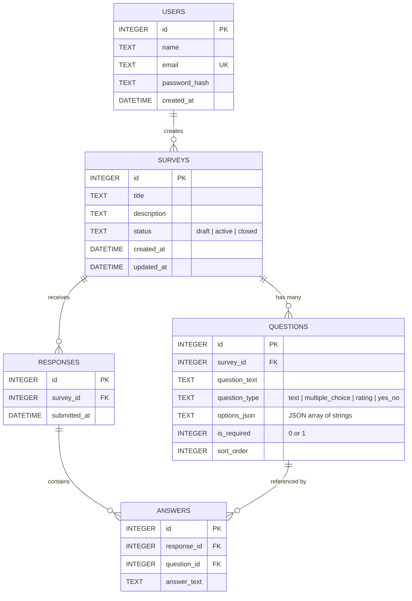

# Research Survey Analytics Dashboard
**CSE499 Final-Semester Internship Program Project**

> A full-stack, research-oriented web application for designing surveys, collecting public respondent data, calculating statistics, rendering custom Canvas visualizations, and generating rule-based automated insights.

---

## 1. Project Overview

The **Research Survey Analytics Dashboard** is a lightweight, dependency-conscious web platform built for researchers and survey administrators. It simplifies the survey lifecycle into three distinct phases: **Creation & Question Authoring**, **Public Response Collection**, and **Interactive Dashboard Analytics & Automated Insights**.

---

## 2. Problem Statement

Researchers and academic institutions often require a straightforward, private, self-hosted mechanism to author specialized questionnaires and immediately analyze participant feedback. Commercial survey builders (e.g., Google Forms, Qualtrics, SurveyMonkey) frequently impose paywalls, third-party vendor lock-in, data privacy ambiguities, or over-complicated feature sets. 

Furthermore, analyzing raw survey outputs manually using spreadsheets is time-consuming. This project addresses these challenges by delivering an integrated, self-contained system with an automated statistical summary engine and built-in export capabilities.

---

## 3. Project Objectives

- Provide researchers with an intuitive interface to create, manage, and close surveys.
- Enable respondents to submit questionnaire answers via a clean, public URL without needing to register or log in.
- Maintain data integrity in a local, zero-maintenance relational database (**SQLite**).
- Automatically calculate descriptive statistics (averages, distributions, percentages, 7-day trend changes).
- Deliver visual distributions using native **HTML5 Canvas** (no bloated charting libraries).
- Provide a deterministic, rule-based **Automated Insight Engine** that synthesizes clear qualitative findings from collected quantitative numbers.
- Allow full raw data portability via **RFC 4180-compliant CSV Export**.
- Let researchers focus analysis on an exact response period and produce a printable summary for review.

---

## 4. Main Features

1. **Admin Authentication**: Secure session-based login with salted password hashing using Node.js built-in `crypto` (scrypt).
2. **Survey Authoring & Management**:
   - Create surveys with custom titles and researcher descriptions.
   - 4 supported question types:
     - **Short Text**
     - **Multiple Choice** (2 to 6 options)
     - **Rating 1–5**
     - **Yes / No**
   - Question reordering with Up / Down controls.
   - Survey lifecycle management: **Draft**, **Active (Published)**, and **Closed**.
   - Instant inventory search by title/description and status filtering.
3. **Public Respondent Flow**:
   - Clean, distraction-free questionnaire page accessible at `/survey.html?id=:id`.
   - Client-side and server-side validation for required fields.
   - Live completion progress plus an explicit research participation notice and consent checkbox.
   - Double-submission prevention.
   - Professional confirmation "Thank You" screen upon completion.
4. **Interactive Analytics Dashboard**:
   - Overall submission counts and latest response timestamp.
   - Average satisfaction rating across rating questions.
   - **7-Day Response Growth Trend** comparing the recent 7 days vs. previous 7 days.
   - Question-level distributions and percentages.
   - Server-validated inclusive date filters that update totals, charts, insights, and exports together.
   - Browser print layout for a clean hard copy or **Save as PDF** report.
5. **HTML5 Canvas Chart Engine**:
   - Pure Vanilla JS canvas renderer supporting horizontal bar charts and rating breakdowns.
   - High-DPI (Retina) scaling support for crisp presentation on university projectors and laptop screens.
6. **Automated Research Insight Engine**:
   - Deterministic, rule-based synthesis of findings (e.g., majority choices, positive/negative rating thresholds, modal responses).
   - Labeled transparently: *"Rule-based automated summary generated from survey responses"*.
7. **Native CSV Data Export**:
   - Download the complete or date-filtered response table as a standardized CSV file directly from the browser.
8. **QR Survey Sharing**:
   - Open a Share dialog for active surveys with a locally generated, phone-scannable QR code, public URL, copy action, and PNG download.
9. **Survey Preview Before Publishing**:
   - Review the current builder state in a responsive respondent-style preview before publishing, including every question type, required indicators, consent text, and validation warnings.
   - Preview mode is strictly non-submittable: it stores no changes and cannot create a public survey response.

---

## 5. Technology Stack

This application strictly adheres to the core undergraduate curriculum stack with zero frontend frameworks or heavy external libraries:

| Layer | Technologies | Justification |
| :--- | :--- | :--- |
| **Frontend** | HTML5, CSS3, Vanilla JavaScript | Native web standards, fast loading, 100% transparent code. |
| **Data Visualization** | HTML5 `<canvas>`, 2D Context API | Lightweight, custom styling, no external dependencies like Chart.js or D3. |
| **Backend** | Node.js, Express.js | Standard asynchronous I/O and clean REST routing. |
| **Session Auth** | `express-session` | Cookie-based session state management for admin access. |
| **Database** | SQLite via `sql.js` (WebAssembly) | Serverless, relational, ACID-compliant file-based storage with foreign key constraints. |
| **Security** | Node.js `crypto` | Built-in password hashing (`scrypt`) with cryptographic salts. |

---

## 6. System Architecture

```
                       ┌─────────────────────────────────────────┐
                       │          Client Web Browser             │
                       │   (HTML5 + Vanilla CSS3 + Vanilla JS)   │
                       └───────────────────┬─────────────────────┘
                                           │ HTTP / JSON REST
                                           ▼
                       ┌─────────────────────────────────────────┐
                       │           Express.js Server             │
                       │   - Session Authentication Guard        │
                       │   - REST API Controllers                │
                       │   - Automated Insight Logic             │
                       │   - Native RFC 4180 CSV Generator       │
                       └───────────────────┬─────────────────────┘
                                           │ Parameterized SQL Queries
                                           ▼
                       ┌─────────────────────────────────────────┐
                       │             SQLite Database             │
                       │           (data/survey.db)              │
                       │  - Users, Surveys, Questions,           │
                       │    Responses, Answers                   │
                       │  - PRAGMA foreign_keys = ON             │
                       └─────────────────────────────────────────┘
```

---

## 7. Folder Structure

```
research-survey-dashboard/
│
├── package.json              # Express, sql.js, Express-Session dependencies
├── server.js                 # Express server configuration, REST APIs, and auth
├── database.js               # SQLite connection, schema definition, and crypto
├── seed.js                   # Demo dataset seeder (25 responses, 14-day history)
├── README.md                 # Complete project guide and documentation
├── DEFENSE_GUIDE.md          # 5-minute defense demo script & viva Q&A
│
├── data/
│   └── survey.db             # Auto-generated SQLite database file
│
└── public/
    ├── login.html            # Admin authentication page
    ├── dashboard.html        # Main admin overview and summary metrics
    ├── surveys.html          # Survey inventory, publishing, and closing actions
    ├── create-survey.html    # Dynamic survey builder and question reordering
    ├── survey.html           # Public respondent questionnaire
    ├── analytics.html        # Hero analytics page, canvas charts, and insights
    │
    ├── css/
    │   └── styles.css        # Design system, CSS variables, responsive layout
    │
    └── js/
        ├── common.js         # Session guard, toast notification system, modal
        ├── login.js          # Admin login controller
        ├── dashboard.js      # Dashboard metrics loader
        ├── surveys.js        # Survey management and link copying
        ├── create-survey.js  # Dynamic question builder logic
        ├── survey.js         # Public form renderer and validation
        └── analytics.js      # Canvas chart engine and automated insights
```

---

## 8. Database Schema & Relationships

Foreign key constraints are enforced (`PRAGMA foreign_keys = ON;`).



---

## 9. API Endpoints

### Authentication (`/api/auth`)
- `POST /api/auth/login` — Sign in with email and password.
- `POST /api/auth/logout` — Destroy session and clear cookies.
- `GET /api/auth/me` — Inspect current session authentication status.

### Dashboard & Surveys (`/api/dashboard`, `/api/surveys`)
- `GET /api/dashboard` — Overview counts and recent surveys list (Protected).
- `GET /api/surveys` — All surveys with response counts (Protected).
- `POST /api/surveys` — Create a survey with questions (Protected).
- `GET /api/surveys/:id` — Retrieve survey metadata and questions (Protected).
- `PUT /api/surveys/:id` — Update survey title, description, or questions (Protected).
- `DELETE /api/surveys/:id` — Delete survey (Protected; allowed only if 0 responses exist).
- `POST /api/surveys/:id/publish` — Validate questions and activate survey (Protected).
- `POST /api/surveys/:id/close` — Set survey status to closed (Protected).

### Public Survey Submission (`/api/public`)
- `GET /api/public/surveys/:id` — Public survey details and questions (Open).
- `POST /api/public/surveys/:id/responses` — Submit completed response (Open).

### Analytics & Export (`/api/surveys/:id`)
- `GET /api/surveys/:id/analytics?from=YYYY-MM-DD&to=YYYY-MM-DD` — Statistical calculations and automated insights for an optional inclusive response period (Protected).
- `GET /api/surveys/:id/export.csv?from=YYYY-MM-DD&to=YYYY-MM-DD` — Download an RFC 4180 CSV using the same optional period (Protected).

Both date parameters are optional. Invalid calendar dates and reversed ranges return HTTP 400, and every value is passed through parameterized SQL queries.

---

## 10. Installation & Running Instructions

### Prerequisites
- [Node.js](https://nodejs.org/) (Version 16.x or higher)
- npm (bundled with Node.js)

### Step 1: Clone or Navigate to Project
```bash
cd research-survey-dashboard
```

### Step 2: Install Dependencies
```bash
npm install
```
*(On Windows PowerShell, if script execution is restricted, run: `cmd.exe /c npm install`)*

### Step 3: Run the Application
```bash
npm start
```

### Step 4: Open in Web Browser
Open your browser and navigate to:
```
http://localhost:3000
```

---

## 11. Demo Credentials & Seeding

### Default Admin Account (Seeded automatically on server start)
> **Notice**: For local defense demonstration only.
- **Email**: `admin@research.local`
- **Password**: `Admin123!`

### Populating Demo Dataset (Recommended for Defense Presentation)
To populate a realistic dataset with a 14-day history, run:
```bash
node seed.js
```
This populates the *"Customer Satisfaction Survey"* with 25 realistic responses, allowing immediate demonstration of:
- High-level metric cards.
- Positive rating trends.
- Multiple-choice distribution charts.
- Yes/No comparison charts.
- Automated insight statements.
- Date-range filtering with synchronized metrics and charts.
- CSV export file generation.
- Print-ready analytics reports that can be saved as PDF.

*(Running `node seed.js` multiple times will not duplicate the survey).*

---

## 12. How the Automated Insight Engine Works

The **Automated Insight Engine** is a deterministic, rule-based inference module implemented entirely in standard JavaScript. It does not make external API calls and does not use artificial intelligence or machine learning.

### Rules & Logic:
1. **Rating Insights**:
   - Calculates the exact mathematical average: $\bar{x} = \frac{\sum x_i}{N}$.
   - Classifies ratings: Positive ($\ge 4$), Neutral ($= 3$), Negative ($\le 2$).
   - If positive proportion $\ge 70\%$: *"Most respondents reported a positive rating (X%)."*
   - If positive proportion $\ge 50\%$: *"More than half of respondents reported a positive rating (X%)."*
   - If negative proportion $\ge 30\%$: *"A notable portion of respondents reported lower ratings (X%)."*
   - Identifies the mathematical mode: *"Rating X was the most frequently selected response."*
   - Overall sentiment classification: $\ge 4.0$ (Strongly Positive), $\ge 3.0$ (Moderately Positive), $< 3.0$ (Requires Attention).
2. **Multiple Choice Insights**:
   - Identifies the statistical mode: *"The most selected option was '[Option]' with X% of responses."*
   - Identifies the least selected option when sample size $N \ge 10$.
3. **Yes/No Insights**:
   - Calculates percentages for both choices.
   - Highlights a clear majority when one option reaches $\ge 60\%$.
4. **7-Day Trend Growth**:
   - Analyzes response submission timestamps in two windows: $[T-7, T]$ vs. $[T-14, T-7]$.
   - Computes percentage change: $\frac{\text{Current} - \text{Previous}}{\text{Previous}} \times 100\%$.
   - Highlights growth, decline, or marks *"Not enough data for trend comparison"* if no prior baseline exists.

---

## 13. Security Considerations

- **SQL Injection Prevention**: 100% of SQLite database queries use parameterized placeholders (`?`).
- **Cross-Site Scripting (XSS) Prevention**: User-entered responses and question texts are rendered using `textContent` and HTML escaping rather than raw `innerHTML`.
- **Credential Protection**: Passwords are never stored in plaintext. They are salted and hashed using Node's cryptographic primitives (`scrypt`).
- **Data Integrity Protection**: Surveys that have recorded responses cannot be deleted (they must be closed instead), preventing accidental data loss.

---

## 14. Limitations & Future Work

- **Current Scope**: Single-admin architecture designed for individual researchers and academic defense demonstration.
- **Future Improvements**:
  - Multi-tenant role management (Collaborators vs. Primary Investigators).
  - Conditional branching logic (skip questions based on earlier answers).
  - Scheduled, server-generated branded PDF reports and email delivery.
  - Response segmentation and cross-tabulation across demographic groups.
  - Persistent production session storage and environment-managed secrets.
